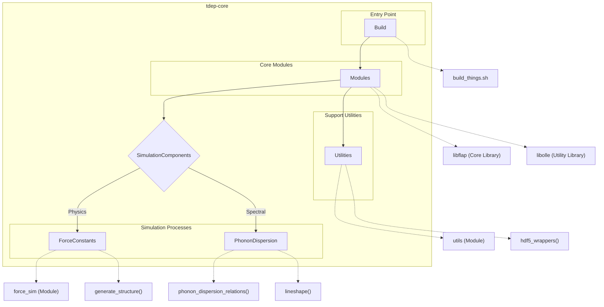

# Overview - Testing adding new text to README

This repository is a scientific computing toolkit designed for the analysis, simulation, and extraction of physical, thermal, and dynamic properties in crystalline and atomic systems. With a focus on computational materials science, it provides tools for evaluating phonon dispersion relations, thermal conductivity, anharmonic free energy, and atomic distributions. The implementation leverages advanced numerical methods, physics-based models, and modular programming in Fortran to support high-precision simulations and scientific workflows. 

Equipped with modules for handling symmetry operations, phase-space energy mapping, quadratic programming solutions, crystal structure refinement, and fast Fourier transform (FFT) operations, the repository is a versatile platform tailored for researchers in computational physics, materials engineering, and crystallography. It supports interoperability with High-Performance Computing (HPC) environments, includes extensive testing and validation frameworks, and offers flexible output options for analysis and visualization in various formats such as HDF5.

---

## Key Features

- **Phonon Dispersion Relations**: Computation and visualization of phonon dispersion along defined paths in the Brillouin zone, supporting secondary properties like group velocities and linewidths.

- **Thermal Conductivity Analysis**: State-of-the-art simulation tools for predicting lattice thermal conductivity using phonon scattering mechanisms, including three-phonon and four-phonon interactions.

- **Crystal Structure Refinement**: Interactive tools for symmetry labeling, Bravais lattice classification, and refinement of atomic positions within crystals.

- **Anharmonic Free Energy Calculations**: Evaluate anharmonic free energy contributions using atomic displacements and higher-order force constants.

- **Quadratic Programming Solvers**: Active set methods and optimization routines to solve materials science-focused constrained quadratic programming problems with symmetric positive definite matrices.

- **Phase Space Surface Analysis**: Visualize and compute phase space surfaces for three-phonon scattering events and related energy calculations.

- **Atomic Distribution Analysis**: Tools for analyzing atomic pair distributions, diffraction patterns, mean square displacements, and projected distributions in molecular dynamics simulations.

- **FFT Utilities**: Optimized wrapper methods leveraging the FFTW library for high-dimensional numerical operations, including Fourier transforms, autocorrelations, and convolutions.

- **Multi-Platform HPC Support**: Environment-specific compilation settings and MPI-enabled parallelization for scaling computational workloads across HPC clusters.

- **Comprehensive Testing and Documentation**: Includes automated test suites with preloaded examples and workflows for validation. Rich documentation explains module functionalities, installation setups, and scientific computation use cases.

- **Flexible Output Formats**: Results can be exported in HDF5, plaintext, or GNUplot-compatible formats for further analysis and visualization.

This repository is an essential companion for researchers requiring high-performance simulation tools to explore dynamic properties of materials and refine structural data under broad scientific conditions.

# Layout and Architecture
```
# Commented File Tree

cc056690-8d59-4e9b-b3ad-fbf9af16bb9e
└── tdep
    ├── .github                             # GitHub workflows, issue templates, and settings files
    │   ├── ISSUE_TEMPLATE
    │   │   └── error.md                   # Template for issue reporting
    │   ├── important_settings.*           # Various compilation configuration files for different platforms
    │   └── workflows
    │       ├── ci_simple_compilation_and_test.yml  # CI pipeline for build and test
    │       └── draft-pdf.yml                        # PDF generation workflow
    ├── CITATION.cff                        # Citation metadata for research use
    ├── README.md                           # Main documentation and overview
    ├── INSTALL.md                          # Installation instructions
    ├── LICENSE.md                          # License for the repository
    ├── build_things.sh                     # Script for building the software
    ├── docs                                # Documentation with guides and images
    │   ├── README.md                       # Introductory guide to the documentation
    │   ├── media/                          # Visualizations and media for documentation
    │   └── program/                        # Component-specific guides (e.g., thermal conductivity, phonon dispersion)
    ├── examples                            # Usage examples for running simulations
    │   ├── example_1_fcc_al/               # FCC Aluminum simulation example
    │   ├── example_2_ScF3/                 # ScF3 example (e.g., VASP OUTCAR files)
    │   └── example_3_convert_ddb/          # DDB file conversion example
    ├── paper                               # Research paper draft and bibliography
    │   ├── literature.bib                  # References for academic citations
    │   └── paper.md                        # Markdown draft of the paper
    ├── src                                 # Core source code organized by key functionalities
    │   ├── anharmonic_free_energy/         # Modules for anharmonic free energy calculations
    │   │   ├── energy.f90                  # Main module for energy calculations
    │   │   ├── energy_aux.f90              # Auxiliary functions for energy evaluations
    │   │   ├── energy_dos.f90              # DOS calculations related to energy
    │   │   ├── epot.f90                    # Potential energy calculations
    │   │   ├── main.f90                    # Main driver for this module
    │   │   └── options.f90                 # Handles input and configuration
    │   ├── atomic_distribution/            # Tools for analyzing atomic distributions
    │   │   ├── correlationfunction.f90     # Correlation function calculations
    │   │   ├── diffraction.f90             # Poweder diffraction and crystal analysis
    │   │   ├── mean_square_displacement.f90 # Mean squared displacement calculations
    │   │   ├── pair_distribution.f90       # Computes atomic pair distributions
    │   │   └── vectordist.f90              # Vector-based distance calculations
    │   ├── generate_structure/             # Tools for creating atomic structures
    │   │   ├── autocell.f90                # Automates cell generation for symmetry
    │   │   ├── magneticdisorder.f90        # Simulations with magnetic disorder in structures
    │   │   └── main.f90                    # Driver module
    │   ├── libflap/                        # CLI utilities and command-line modules
    │   │   ├── flap.f90                    # Main library for argument parsing
    │   └── libolle/                        # Shared utilities for numerical operations and geometry
    │       ├── cgal_wrappers.f90           # Wrappers for CGAL geometry utilities
    │       ├── fftw_wrappers.f90           # Wrappers for FFTW's FFT implementations
    │       ├── geometryfunctions.f90       # Geometry-specific helper functions
    │       ├── quadratic_programming_slvr.f90 # Solver for quadratic programming problems
    │       └── type_forceconstant_*        # Series of modules focused on force constant calculations
    │   ├── lineshape/                      # Tools for analyzing phonon/electron scattering and lifetime
    │   │   ├── phonondamping.f90           # Main calculation for phonon damping
    │   │   ├── phonondamping_threephonon.f90 # Three-phonon process modeling
    │   │   └── scatteringrates.f90         # Computes scattering rates for damping
    │   ├── phonon_dispersion_relations/    # Modules for analyzing phonon dispersion relations
    │   │   ├── activity.f90                # Spectral activity and phonon data output
    │   │   ├── densityplots.f90            # Phonon DOS and density plotting
    │   │   ├── velocitydos.f90             # Velocity and DOS calculations
    │   │   └── unfold_phonons.f90          # Band structure unfolding routines
    │   ├── thermal_conductivity/           # Tools to compute thermal conductivity
    │   │   ├── scattering.f90              # Modules to analyze scattering contributions
    │   │   ├── kappa.f90                   # Main tool for deriving conductivity tensors
    │   │   └── cumulative_kappa.f90        # Accumulated thermal properties
    ├── tests                               # Contains test cases for validating each module
    │   ├── anharmonic_free_energy/         # Tests for anharmonic free energy modules
    │   ├── atomic_distribution/            # Validation tests for distribution analysis
    │   ├── phonon_dispersion_relations/    # Tests for dispersion calculations
    │   ├── thermal_conductivity/           # Tests for scattering-based thermal conductivity validation
    │   └── pytest.ini                      # Test configuration and metadata
```




## Usage Examples

### Build


To build the project, ensure you have the required environment. Use the following commands:

```
mkdir build
cd build
cmake ..
make
```

This process will create the binaries in the build directory.


### Test


To test the project, navigate to the build directory and run the tests:

```
ctest
```

This runs all configured test cases associated with the repo.


### Run


To run simulations, use the driver programs. For example:

```
./lineshape <lineshape-options>
./thermal_conductivity <conductivity-options>
```

Replace `<lineshape-options>` and `<conductivity-options>` with appropriate arguments or config files. Refer to the module documentation for detailed options.


Repo Structure:
find tdep: executed successfully


# Implemented User Stories

## Thermal Conductivity
- [ ] As a materials scientist, I want to calculate the thermal conductivity tensor, so that I can understand a material's heat transport properties, which requires input force constants and temperature data.
- [ ] As a researcher, I want to compute off-diagonal thermal conductivity contributions, so that I can evaluate coherence effects in phonon transport, which requires symmetry operations and mode interactions.
- [ ] As a user, I want to generate cumulative mean free path plots, so that I can analyze transport properties at different length scales, which requires integration over thermal properties.
- [ ] As a data analyst, I want to iteratively solve the Boltzmann Transport Equation, so that I can model collective phonon behaviors, which requires scattering rates and iterative methods.

## Phonon Dispersion Relations
- [ ] As a researcher, I want to compute phonon dispersion relations across a Brillouin zone, so that I can understand vibrational behaviors in materials, which requires force constants and q-point mesh generation.
- [ ] As a physicist, I want to analyze density of states (DOS) for phonons, so that I can evaluate vibrational mode distributions, which requires tetrahedron or Gaussian integration methods.
- [ ] As a materials scientist, I want to calculate Raman and IR activity of modes, so that I can identify spectroscopic signatures of materials, which requires eigenmode analysis.
- [ ] As an engineer, I want to unfold phonon band structures, so that I can interpret supercell band folding effects, which requires enhanced resolution and symmetry handling.

## Anharmonic Free Energy
- [ ] As a physicist, I want to calculate anharmonic free energy corrections, so that I can evaluate temperature-dependent thermodynamics, which requires third-order and fourth-order force constants.
- [ ] As a researcher, I want to compute perturbative anharmonic corrections, so that I can model high-temperature behaviors, which requires iterative cumulant expansions.

## Structure and Molecular Dynamics
- [ ] As a computational chemist, I want to calculate symmetry-projected pair distribution functions, so that I can analyze molecular dynamics trajectory data, which requires time-averaged histograms.
- [ ] As an experimentalist, I want to simulate powder diffraction patterns, so that I can compare with X-ray data, which requires lattice vectors and atomic positions.
- [ ] As a researcher, I want to verify a simulated supercell's symmetry consistency, so that I can ensure accuracy in structural transformations, which requires symmetry mapping and transformation matrices.
- [ ] As a user, I want to extract statistically decoupled timesteps from MD simulations, so that I can optimize data sampling, which requires Monte Carlo selection methods.

## Command-Line Interface (CLI) Utilities
- [ ] As a developer, I want to define command-line options for configuration files, so that users can customize simulations, which requires parameter parsing and validation functions.
- [ ] As an advanced user, I want to implement mutually-exclusive command-line groups, so that I can ensure consistent argument parsing, which requires error-checking routines.
- [ ] As a researcher, I want auto-generated CLI usage documentation, so that I can share reproducible workflows, which requires markdown output support.
- [ ] As an administrator, I want to track memory allocation usage, so that I can debug memory-intensive computations, which requires MPI and memory trackers.

## Numerical Methods and Geometry Processing
- [ ] As a mathematician, I want to compute least squares solutions for constraints, so that I can stabilize force constant extractions, which requires SVD and regression techniques.
- [ ] As a computational scientist, I want to solve quadratic programming problems, so that I can optimize energy configurations, which requires constrained optimization routines.
- [ ] As a materials engineer, I want to generate Voronoi diagrams for periodic systems, so that I can study local atomic environments, which requires geometric tessellation methods.
- [ ] As a simulation engineer, I want fast Fourier transform utilities for spectral analysis, so that I can efficiently compute phonon distributions, which requires FFTW library wrappers.


# Dependencies


## Intrinsic

Standard Fortran intrinsic modules and functions.
- **iso_c_binding**
  - `ALL`
  - `c_double`
  - `c_float`
  - `c_int32_t`
  - `c_int64_t`
- **iso_fortran_env**
  - `ALL`
  - `output_unit`
## Internal

Modules and functions defined within this project that are accessed in a different module or program.
- **konstanter**
  - `ALL`
  - `flyt`
  - `i4`
  - `i8`
  - `lo_A_to_bohr`
  - `lo_A_to_Bohr`
  - `lo_author`
  - `lo_Bohr_to_A`
  - `lo_bohr_to_A`
  - `lo_bohr_to_m`
  - `lo_degenvector`
  - `lo_emu_to_amu`
  - `lo_eV_to_Hartree`
  - `lo_exitcode_baddim`
  - `lo_exitcode_blaslapack`
  - `lo_exitcode_io`
  - `lo_exitcode_mpi`
  - `lo_exitcode_param`
  - `lo_exitcode_physical`
  - `lo_exitcode_symmetry`
  - `lo_force_eVA_to_HartreeBohr`
  - `lo_force_Hartreebohr_to_eVA`
  - `lo_force_hartreebohr_to_eVa`
  - `lo_forceconstant_1st_HartreeBohr_to_eVA`
  - `lo_forceconstant_2nd_eVA_to_HartreeBohr`
  - `lo_forceconstant_2nd_HartreeBohr_to_eVA`
  - `lo_forceconstant_3rd_eVA_to_HartreeBohr`
  - `lo_forceconstant_3rd_HartreeBohr_to_eVA`
  - `lo_forceconstant_4th_eVa_to_HartreeBohr`
  - `lo_forceconstant_4th_HartreeBohr_to_eVA`
  - `lo_freqtol`
  - `lo_frequency_hartree_to_Hz`
  - `lo_frequency_Hartree_to_Hz`
  - `lo_frequency_hartree_to_icm`
  - `lo_frequency_Hartree_to_icm`
  - `lo_frequency_hartree_to_meV`
  - `lo_frequency_Hartree_to_meV`
  - `lo_frequency_hartree_to_mev`
  - `lo_frequency_hartree_to_THz`
  - `lo_frequency_hartree_to_thz`
  - `lo_frequency_Hartree_to_THz`
  - `lo_frequency_THz_to_hartree`
  - `lo_frequency_THz_to_Hartree`
  - `lo_gitbranch`
  - `lo_gitrevision`
  - `lo_gnuplotterminal`
  - `lo_groupvel_hartreebohr_to_ms`
  - `lo_groupvel_HartreeBohr_to_ms`
  - `lo_groupvel_Hartreebohr_to_ms`
  - `lo_groupvel_ms_to_Hartreebohr`
  - `lo_Hartree_to_eV`
  - `lo_hartree_to_eV`
  - `lo_Hartree_to_Joule`
  - `lo_hbar_hartree`
  - `lo_huge`
  - `lo_hugeint`
  - `lo_imag`
  - `lo_iou`
  - `lo_kappa_au_to_SI`
  - `lo_kappa_SI_to_au`
  - `lo_kb_eV`
  - `lo_kb_hartree`
  - `lo_kb_Hartree`
  - `lo_licence`
  - `lo_m_to_bohr`
  - `lo_m_to_Bohr`
  - `lo_phonongroupveltol`
  - `lo_pi`
  - `lo_pressure_GPa_to_HartreeBohr`
  - `lo_pressure_HartreeBohr_to_GPa`
  - `lo_radiantol`
  - `lo_sqtol`
  - `lo_status`
  - `lo_temperaturetol`
  - `lo_time_au_to_fs`
  - `lo_time_au_to_s`
  - `lo_time_fs_to_au`
  - `lo_time_s_to_au`
  - `lo_tiny`
  - `lo_tol`
  - `lo_twopi`
  - `lo_velocity_au_to_Afs`
  - `lo_version`
  - `lo_volume_A_to_bohr`
  - `lo_volume_bohr_to_A`
  - `r8`
- **gottochblandat**
  - `ALL`
  - `lo_chop`
  - `lo_classical_harmonic_oscillator_free_energy`
  - `lo_clean_fractional_coordinates`
  - `lo_complex_gram_schmidt`
  - `lo_complex_hermitian_eigenvalues_eigenvectors`
  - `lo_compress_equations`
  - `lo_cross`
  - `lo_determ`
  - `lo_does_file_exist`
  - `lo_enforce_linear_constraints`
  - `lo_fermi`
  - `lo_fetch_tolerance`
  - `lo_find_rotation_that_makes_strain_diagonal`
  - `lo_flattentensor`
  - `lo_frobnorm`
  - `lo_gauss`
  - `lo_general_real_eigenvalues_eigenvectors`
  - `lo_get_axis_angles`
  - `lo_harmonic_oscillator_cv`
  - `lo_harmonic_oscillator_entropy`
  - `lo_harmonic_oscillator_free_energy`
  - `lo_identitymatrix`
  - `lo_index_in_periodic_array`
  - `lo_invert3x3matrix`
  - `lo_invert_real_matrix`
  - `lo_kmesh_density`
  - `lo_linear_interpolation`
  - `lo_linear_least_squares`
  - `lo_linspace`
  - `lo_logspace`
  - `lo_looptimer`
  - `lo_lorentz`
  - `lo_make_coeffmatrix_tidy`
  - `lo_mass_from_Z`
  - `lo_mean`
  - `lo_negsqrt`
  - `lo_nullspace_coefficient_matrix`
  - `lo_outerproduct`
  - `lo_planck`
  - `lo_points_on_sphere`
  - `lo_progressbar`
  - `lo_progressbar_init`
  - `lo_put_function_on_new_axis`
  - `lo_real_gram_schmidt`
  - `lo_real_nullspace_coefficient_matrix`
  - `lo_real_pseudoinverse`
  - `lo_real_singular_value_decomposition`
  - `lo_real_symmetric_eigenvalues_eigenvectors`
  - `lo_reciprocal_basis`
  - `lo_return_tensor_transpositions`
  - `lo_return_unique`
  - `lo_return_unique_indices`
  - `lo_rsquare`
  - `lo_signed_tetrahedron_volume`
  - `lo_sqnorm`
  - `lo_stddev`
  - `lo_stop_gracefully`
  - `lo_symmetric_eigensystem_3x3matrix`
  - `lo_trace`
  - `lo_transpositionmatrix`
  - `lo_trapezoid_integration`
  - `lo_triplegemm`
  - `lo_trueNtimes`
  - `lo_unflatten_2tensor`
  - `lo_unflatten_3tensor`
  - `lo_unflatten_4tensor`
  - `lo_unsigned_tetrahedron_volume`
  - `lo_untangle_one_tetrahedron`
  - `lo_verletbox`
  - `open_file`
  - `qsort`
  - `tochar`
  - `walltime`
- **mpi_wrappers**
  - `lo_mpi_helper`
  - `lo_stop_gracefully`
  - `MPI_CHARACTER`
  - `MPI_DOUBLE_COMPLEX`
  - `MPI_DOUBLE_PRECISION`
  - `MPI_IN_PLACE`
  - `MPI_INTEGER`
  - `MPI_SUM`
- **lo_memtracker**
  - `lo_mem_helper`
- **lo_timetracker**
  - `lo_timer`
- **type_forceconstant_secondorder**
  - `ALL`
  - `lo_forceconstant_secondorder`
- **type_forceconstant_thirdorder**
  - `ALL`
  - `lo_forceconstant_thirdorder`
- **lo_dielectric_interaction**
  - `lo_dielectric_tensor`
- **type_qpointmesh**
  - `ALL`
  - `lo_bandstructure`
  - `lo_fft_mesh`
  - `lo_generate_qmesh`
  - `lo_get_small_group_of_qpoint`
  - `lo_integration_weights_for_one_tetrahedron`
  - `lo_LV_tetrahedron_fermi`
  - `lo_LV_tetrahedron_heaviside`
  - `lo_LV_tetrahedron_weights`
  - `lo_monkhorst_pack_mesh`
  - `lo_qpoint`
  - `lo_qpoint_mesh`
  - `lo_read_qmesh_from_file`
  - `lo_wedge_mesh`
- **type_phonon_dispersions**
  - `ALL`
  - `lo_phonon_dispersions`
  - `lo_phonon_dispersions_qpoint`
- **hdf5_wrappers**
  - `h5close_f`
  - `h5dclose_f`
  - `h5dopen_f`
  - `H5F_ACC_RDONLY_F`
  - `H5F_ACC_TRUNC_F`
  - `h5fclose_f`
  - `h5fcreate_f`
  - `h5fopen_f`
  - `h5gclose_f`
  - `h5gcreate_f`
  - `h5gopen_f`
  - `h5open_f`
  - `HID_T`
  - `lo_h5_does_dataset_exist`
  - `lo_h5_read_attribute`
  - `lo_h5_read_data`
  - `lo_h5_store_attribute`
  - `lo_h5_store_data`
  - `lo_hdf5_helper`
- **fftw_wrappers**
  - `lo_abcd_convolution`
  - `lo_convolution`
  - `lo_fft`
  - `lo_ifft`
- **options**
  - `ALL`
  - `lo_opts`
- **phonondamping**
  - `ALL`
  - `lo_phonon_selfenergy`
- **lineshape_helper**
  - `diagonal_greensfunction`
  - `evaluate_spectral_function`
  - `find_spectral_function_max_and_fwhm`
  - `gaussian_smear_distribution`
  - `gaussian_smear_spectral_function`
  - `index_on_grid`
  - `integrate_spectral_function`
  - `integrate_two_spectral_functions`
  - `lo_convolution_helper`
  - `lo_spectralfunction_helper`
  - `taperfn_im`
- **type_forceconstant_fourthorder**
  - `lo_forceconstant_fourthorder`
- **lo_phonon_bandstructure_on_path**
  - `lo_phonon_bandstructure`
- **type_phonon_dos**
  - `lo_phonon_dos`
- **scatteringrates**
  - `lo_listofscatteringrates`
- **lo_realspace_selfenergy**
  - `lo_interpolated_selfenergy`
- **lo_thermal_transport**
  - `lo_thermal_conductivity`
- **type_blas_lapack_wrappers**
  - `ALL`
  - `lo_dgels`
  - `lo_dgelss`
  - `lo_dgemm`
  - `lo_dgemv`
  - `lo_dgesdd`
  - `lo_dgesvd`
  - `lo_dgglse`
  - `lo_dsyevd`
  - `lo_dsyevr`
  - `lo_gemm`
  - `lo_gemv`
  - `lo_zgeev`
  - `lo_zheev`
  - `lo_zhegv`
- **dielscatter**
  - `lo_dielectric_response`
- **lo_brents_method**
  - `lo_brent_helper`
- **quadratures_stencils**
  - `lo_centraldifference`
  - `lo_gaussianquadrature`
- **lo_sorting**
  - `lo_qsort`
  - `lo_return_unique`
  - `lo_return_unique_indices`
- **lo_symmetry_of_interactions**
  - `lo_interaction_tensors`
  - `lo_tensor_pairop`
  - `lo_tensor_quartetop`
  - `lo_tensor_shell`
  - `lo_tensor_singletop`
  - `lo_tensor_tripletop`
- **flap**
  - `ALL`
  - `command_line_interface`
- **flap_command_line_argument_t**
  - `ACTION_PRINT_HELP`
  - `ACTION_PRINT_VERS`
  - `action_store`
  - `ACTION_STORE`
  - `ACTION_STORE_STAR`
  - `ARGS_SEP`
  - `command_line_argument`
- **flap_object_t**
  - `object`
- **penf**
  - `ALL`
- **flap_command_line_arguments_group_t**
  - `command_line_arguments_group`
  - `STATUS_PRINT_H`
  - `STATUS_PRINT_V`
- **flap_command_line_interface_t**
  - `command_line_interface`
- **type_mdsim**
  - `lo_mdsim`
- **pairmapping**
  - `ALL`
  - `lo_pairmapping`
- **dump_data**
  - `lo_dump_gnuplot_2d_real`
  - `lo_dump_palette_to_gnuplot`
- **type_distancetable**
  - `ALL`
  - `lo_distancetable`
  - `lo_distancetable_particle`
- **kappa**
  - `get_kappa`
  - `get_kappa_offdiag`
  - `iterative_solution`
  - `symmetrize_kappa`
- **lo_randomnumbers**
  - `lo_mersennetwister`
- **lo_fftgrid_helper**
  - `fft_fourth_grid_index`
  - `fft_third_grid_index`
  - `lo_montecarlo_grid`
  - `singlet_to_triplet`
  - `triplet_to_singlet`
- **scattering**
  - `lo_scattering_rates`
- **type_symmetrylist**
  - `lo_symlist`
- **type_forcemap**
  - `lo_coeffmatrix_eps_pair`
  - `lo_coeffmatrix_eps_singlet`
  - `lo_coeffmatrix_pair`
  - `lo_coeffmatrix_quartet`
  - `lo_coeffmatrix_singlet`
  - `lo_coeffmatrix_supercell_Z_singlet`
  - `lo_coeffmatrix_supercell_z_singlet`
  - `lo_coeffmatrix_triplet`
  - `lo_coeffmatrix_unitcell_Z_singlet`
  - `lo_coeffmatrix_Z_pair`
  - `lo_coeffmatrix_z_pair`
  - `lo_coeffmatrix_z_triplet`
  - `lo_coeffmatrix_Z_triplet`
  - `lo_forcemap`
  - `lo_secondorder_rot_herm_huang`
- **type_effective_hamiltonian**
  - `lo_effective_hamiltonian`
- **lo_longrange_electrostatics**
  - `lo_ewald_parameters`
- **type_voronoi**
  - `lo_voronoi_diagram`
- **lo_verletboxes**
  - `lo_verletbox`
- **lo_electron_dispersion_relations**
  - `lo_electron_dispersions`
  - `lo_electron_dispersions_kpoint`
- **type_voronoi_distancetable**
  - `ALL`
  - `lo_voronoi_distancetable`
- **type_forceconstant_firstorder**
  - `lo_forceconstant_firstorder`
- **type_jij_secondorder**
  - `lo_jij_secondorder`
- **type_linkedlist**
  - `lo_linked_list`
- **type_fast_interpolation**
  - `lo_fancy_deltri_box`
- **phononevents**
  - `ALL`
  - `lo_find_all_scattering_events`
  - `lo_threephononevents`
- **lo_spacegroup**
  - `lo_symmetry_group`
- **lo_voronoi**
  - `lo_voronoi_cell`
- **penf_global_parameters_variables**
  - `ALL`
- **penf_b_size**
  - `ALL`
- **penf_stringify**
  - `bcton`
  - `bstr`
  - `cton`
  - `str`
  - `strz`
- **flap_utils_m**
  - `ALL`
- **io**
  - `write_lineshape_to_hdf5`
- **type_phasespacesurface**
  - `lo_phasespacesurface`
- **pair_distribution**
  - `ALL`
- **mean_square_displacement**
  - `ALL`
- **diffraction**
  - `ALL`
- **cumulative_kappa**
  - `lo_cumulative_kappa`
- **autocell**
  - `return_supercellmatrix`
- **energy**
  - `perturbative_anharmonic_free_energy`
- **epot**
  - `lo_energy_differences`
- **velocitydos**
  - `calculate_everything`
  - `lo_calculate_U0`
- **densityplots**
  - `inelastic_spectra`
- **activity**
  - `estimate_activity`
- **scatteringstrengths**
  - `calculate_scattering_amplitudes`
- **pbe**
  - `calculate_qs`
  - `get_kappa`
  - `get_kappa_offdiag`
  - `get_selfconsistent_solution`
- **mfp**
  - `get_cumulative_plots`
  - `lo_mfp`
  - `write_cumulative_plots`
- **refine**
  - `ALL`
- **semirandom**
  - `generate_semirandom_configurations`
- **ifc_solvers**
  - `lo_solve_for_borncharges`
  - `lo_solve_for_irreducible_ifc`
  - `lo_solve_for_irreducible_ifc_fastugly`
- **cgal_wrappers**
  - `ALL`
- **quadratic_programming**
  - `lo_solve_quadratic_program`
## External Fortran

External Fortran modules and functions used by this project.
- **type_crystalstructure**
  - `ALL`
  - `lo_crystalstructure`
- **type_symmetryoperation**
  - `lo_eigenvector_transformation_matrix`
  - `lo_expandoperation_pair`
  - `lo_expandoperation_quartet`
  - `lo_expandoperation_triplet`
  - `lo_operate_on_secondorder_tensor`
  - `lo_operate_on_vector`
  - `lo_spacegroup_operation`
  - `lo_symset`
- **geometryfunctions**
  - `lo_angle_between_vectors`
  - `lo_bounding_sphere_of_box`
  - `lo_geometryobject`
  - `lo_improper_rotation_matrix_from_axis_and_angle`
  - `lo_inscribed_sphere_in_box`
  - `lo_linesegment`
  - `lo_plane`
  - `lo_polygon`
  - `lo_polyhedron`
  - `lo_rotation_matrix_from_axis_and_angle`
  - `lo_rotation_matrix_from_vector_a_to_b`
- **hdf5**
  - `ALL`
- **mpi**
  - `ALL`
## External Functions

External (non-Fortran, bound with the C ABI) functions called by this project.
- `cgal_chull2d`
- `cgal_chull3d`
- `cgal_chull3d_intersection`
- `cgal_delete_double_pointer`
- `cgal_delete_int_pointer`
- `cgal_deltri2d`
- `cgal_deltri3d`
- `cgal_tesselate_polyhedron`
## Sys Calls

System calls invoked by this project.
- `execute_command_line: []`
- `execute_command_line: []`
